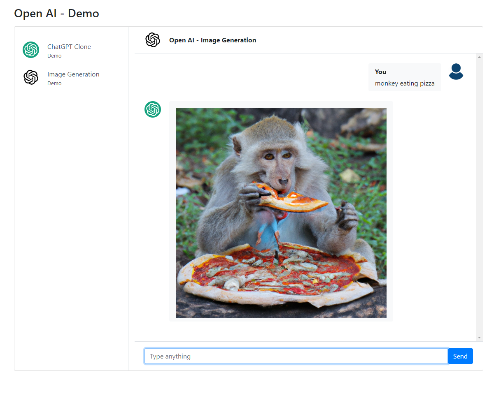

# OpenAI ChatGPT Clone

This is a demonestration of using Open AI API for text completion and image generation. The app is built with Node.js and Express that uses :
- text-davinci-003 model
- [OpenAI's Dall-E models](https://beta.openai.com/docs/guides/images).



## Usage

Generate an API KEY at [OpenAI](https://beta.openai.com/) and add it to the `.env` file.

Install the dependencies

```bash
npm install
```

Run server

```bash
npm start
```
DEMO: [https://open-ai-chatgpt-clone.onrender.com/index.html](https://open-ai-chatgpt-clone.onrender.com/index.html)
